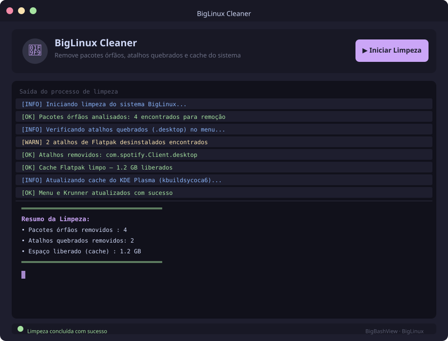

# BigLinuxCleaner

Script Bash para limpeza e manutenção do **Big Linux** (e outros sistemas baseados em Arch com KDE Plasma). Ele realiza as seguintes tarefas automaticamente:

- **Remove pacotes órfãos** via `pacman` (pacotes instalados como dependência que não são mais necessários).
- **Limpa atalhos quebrados** (`.desktop`) no menu de aplicativos — verifica entradas inválidas nos diretórios do sistema, do usuário, do Flatpak e do Snap.
- **Remove atalhos de apps Flatpak desinstalados** cruzando os arquivos `.desktop` com a lista de aplicativos instalados.
- **Remove atalhos de apps Snap desinstalados** de forma semelhante.
- **Limpa o cache do Flatpak** (cache local do usuário e cache global) e remove runtimes/pacotes sem uso.
- **Limpa revisões desabilitadas do Snap** e o cache do daemon.
- **Atualiza o menu e o cache do KDE Plasma** (`kbuildsycoca`, `krunner`, `plasmashell`) para refletir as mudanças imediatamente.

## Interface Gráfica (GUI)

Uma interface gráfica está disponível para uso interativo, construída com [BigBashView](https://github.com/biglinux/bigbashview).



### Pré-requisito

O BigBashView deve estar instalado (já incluso no BigLinux):

```bash
# BigLinux / Arch
sudo pacman -S bigbashview
```

### Lançar a GUI

```bash
git clone https://github.com/zonaro/BigLinuxCleaner.git
cd BigLinuxCleaner
bash launch.sh
```

A janela mostra cada etapa da limpeza em tempo real com cores por nível de log. O processo de limpeza roda em segundo plano e a interface atualiza automaticamente a cada 500 ms.

> A GUI solicita a senha de `sudo` via dialog gráfico nativo do KDE (ksshaskpass) quando necessário.

---

## Uso rápido (curl)

Execute o script diretamente no terminal sem precisar clonar o repositório:

```bash
curl -fsSL https://raw.githubusercontent.com/zonaro/BigLinuxCleaner/main/cleaner.sh | bash
```

> **Atenção:** sempre inspecione scripts antes de executá-los com privilégios. Você pode visualizar o conteúdo completo em [`cleaner.sh`](./cleaner.sh).

## Uso manual

```bash
# Clone o repositório
git clone https://github.com/zonaro/BigLinuxCleaner.git
cd BigLinuxCleaner

# Torne o script executável e execute
chmod +x cleaner.sh
./cleaner.sh
```

## Requisitos

| Ferramenta | Obrigatória | Observação |
|---|---|---|
| `bash` ≥ 4 | ✅ | Necessário para arrays associativos |
| `pacman` | ✅ | Limpeza de órfãos (Arch/BigLinux) |
| `sudo` | ✅ | Remoção de arquivos em `/usr` e `/var` |
| `flatpak` | ⬜ | Ignorado se não encontrado |
| `snap` | ⬜ | Ignorado se não encontrado |
| `kbuildsycoca5`/`6` | ⬜ | Atualização do KDE (ignorado se ausente) |

## Licença

Distribuído sob a licença MIT. Consulte o arquivo [LICENSE](./LICENSE) para mais detalhes.
